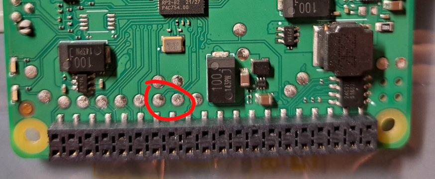

## Introduction

Hachi (八, meaning the number 8 in Japanese) is a serial bootloader for Raspberry Pi BuildHAT.

Hachi has nothing to do with the original BuildHAT bootloader (aka. BHBL), and especially
it won't (neither it's the intended purpose to) load [the BuildHAT firmware](https://github.com/RaspberryPiFoundation/python-build-hat/blob/main/buildhat/data/firmware.bin). Once flashed onto the BuildHAT board Hachi replaces BHBL, and you lose it for good,
until you recover it by some means, such as described [later](#restore-bhbl-with-openocd).

BuildHAT has a total of 2 MB flash memory, out of which Hachi uses a bit more than 64 KB:
- The first page at the beginning (256 bytes, address range 0x10000000-0x10000100) where the 2nd stage boot binary (boot_stage2) resides
- The last 64-KB sector at the end (0x101f0000-0x10200000) occupied by Hachi executable

The rest space is for free use by custom programs. 

At boot up time Hachi waits for about 0.1 sec to accept custom program file transfer from
the serial interface (uart0) before it attempts to launch any previously saved program.
The serial transfer parameters are:

- Baud rate: 115200
- Frame format: 8 data bits, no parity check, 1 stop bit (8N1)
- Tranfer protocol: XModem with CRC
- File format: UF2

The program will be flashed/programmed/saved/written/burned to flash memory at the 
target address as specified by UF2 metadata. During the flashing process the red
LED flashes fast. 

After a successful programming the custom program will be booted immediately, and 
from that moment on Hachi would cease to exist (until next power-up).


## Build & Install

Build against Raspberry Pi Pico SDK.

Unfortunately the first step is always the hardest. The original BHBL loads no 3rd
party but officially signed firmware. That closes the door for us to install Hachi 
or any other unoffical programs via the serial port. However we can access the
SWD interface:



The marked solder spots lead to swdio & swdclk pins respectively. Hook it up to
a debugger adapater any way you prefer then fire up OpenOCD:

```sh
openocd ... -f target/rp2040.cfg -c "program hachi.elf verify reset exit"
```

Connect a serial terminal to BuildHAT (consult official document of the Raspberry
Pi [40-pin header](https://www.raspberrypi.com/documentation/computers/raspberry-pi.html#gpio-and-the-40-pin-header) to locate the serial pins). If Hachi has been 
successfully installed & running, it will spit out an upper case 'C' every a few seconds.

Since Hachi is capable of loading custom programs, it's possible to update Hachi itself
or restore BHBL just by the serial port.


### Restore BHBL with OpenOCD

We have to provide the target address with .bin firmware.

```sh
openocd ... -f target/rp2040.cfg -c "program bhbl_ver.1631704133.bin verify reset exit 0x10000000"
```

For anyone's convenience [here](./doc/bhbl_ver.1631704133.bin) is a copy of it.


## Requirements for Custom Programs

Hachi locates the vector table of the custom program at offset 256 from the beginning 
address, which can be any 256-byte flash page boundary, not necessarily 0x10000000 (XIP_BASE, the beginning of the flash memory).

Pico SDK generated flash binaries satisfy the beginning address requirement.

The custom program **CAN** overlap Hachi boot_stage2, however those 256 bytes will be 
skipped and not actually written to flash.

The custom program **MUST NOT** overlap Hachi executable, or, the last sector of the flash.
